# Guia de Utilização — PNCP em Números

> **Tipo:** Manual
> **Público-alvo:** Analistas, gestores e demais usuários do painel PNCP em Números
> **Objetivo:** Guiar o usuário na leitura, interpretação e análise dos indicadores e visualizações do painel PNCP em Números.

O **PNCP em Números** é um painel desenvolvido em Power BI que consolida dados do Portal Nacional de Contratações Públicas (PNCP), permitindo a análise de contratações públicas brasileiras sob diferentes perspectivas: temporal, territorial, institucional e mercadológica.

Este manual descreve as três páginas do painel — **Visão Geral**, **Contratações Publicadas** e **Contratações Homologadas** —, detalhando os indicadores, visualizações e filtros disponíveis em cada uma, e orientando o usuário sobre como extrair as análises mais relevantes.

---

## Sumário

- [PNCP em Números – Página de Visão Geral](#pncp-em-números--página-de-visão-geral)
  - [1. Objetivo da página](#1-objetivo-da-página)
  - [2. Estrutura da página e entendimento inicial da visualização](#2-estrutura-da-página-e-entendimento-inicial-da-visualização)
  - [3. Indicadores principais](#3-indicadores-principais)
  - [4. Filtros](#4-filtros)
  - [5. Conclusão sobre a Página de Visão Geral](#5-conclusão-sobre-a-página-de-visão-geral)
- [PNCP em Números – Página Contratações Publicadas](#pncp-em-números--página-contratações-publicadas)
  - [6. Objetivo da página](#6-objetivo-da-página)
  - [7. Indicadores principais](#7-indicadores-principais)
  - [8. Filtros](#8-filtros)
  - [9. Conclusão sobre a Página Contratações Publicadas](#9-conclusão-sobre-a-página-contratações-publicadas)
- [PNCP em Números – Página Contratações Homologadas](#pncp-em-números--página-contratações-homologadas)
  - [10. Objetivo da Página](#10-objetivo-da-página)
  - [11. Indicadores Nacionais Principais](#11-indicadores-nacionais-principais)
  - [12. Indicadores Internacionais Principais](#12-indicadores-internacionais-principais)
  - [13. Filtros](#13-filtros)
  - [14. Conclusão sobre a Página Contratações Homologadas](#14-conclusão-sobre-a-página-contratações-homologadas)

---

## PNCP em Números – Página de Visão Geral

### 1. Objetivo da página

A página Visão Geral tem como função permitir, em poucos segundos:

- Entender o volume total de contratações no país;
- Comparar Publicado vs. Homologado;
- Identificar padrões por tempo, UF e esfera;
- Detectar concentração e comportamento das contratações.

### 2. Estrutura da página e entendimento inicial da visualização

A leitura segue uma lógica de cima para baixo e da esquerda para a direita.

:::{note}
As cores têm relevância no painel: **verde** representa valores **Publicado**, enquanto **azul** representa valores **Homologado**. Essa convenção de cores é mantida em todas as visualizações do painel.
:::

### 3. Indicadores principais

#### Cards de KPI's

Nos KPI's de contratações publicadas temos:

- Valor Publicado (Publicado - Vlr R$);
- Quantidade de itens Publicados (Publicado - Qtd Itens);
- Quantidade de Contratações Publicadas (Publicado - Qtd Contratações);
- Quantidade de Portais os quais foram feitas as publicações (Publicado - Qtd Portais).

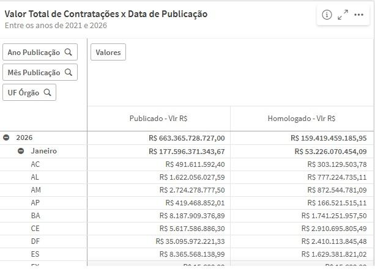

Enquanto nos KPI's de contratações homologadas temos:

- Valor Homologado (Homologado - Vlr R$);
- Quantidade de itens Homologados (Homologado - Qtd Itens);
- Quantidade de Contratações Homologadas (Homologado - Qtd Contratações);
- Quantidade de Portais os quais foram feitas as homologações (Homologado - Qtd Portais).

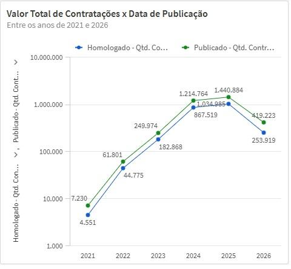

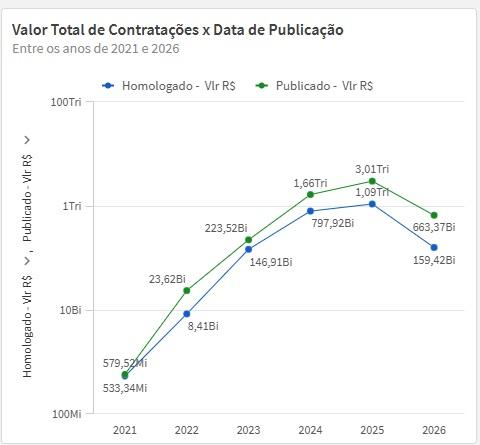

Esses indicadores gerais têm como objetivo fornecer uma visão rápida e consolidada do comportamento das contratações públicas registradas no PNCP, permitindo identificar o volume financeiro movimentado, a quantidade de contratações realizadas, o quantitativo de itens envolvidos e a abrangência dos portais utilizados.

:::{important}
**Publicado ≠ Homologado.** O valor publicado representa a *intenção* de contratação; o valor homologado representa o que foi *efetivamente contratado*. A diferença entre eles é um dos principais indicadores de eficiência do processo licitatório.
:::

---

#### Tendência temporal

Aqui temos um gráfico de linha temporal de Valor Total de Contratações x Data de Publicação que compara os valores publicados e homologados ano à ano. Os valores em Reais (R$) podem ser alterados para Quantidade de contratações Publicadas e Homologadas.

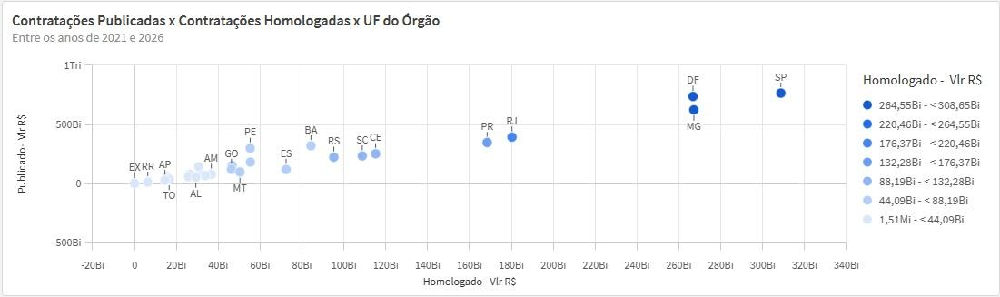

A ideia desse gráfico é verificar a evolução financeira e quantitativa das contratações ao longo dos anos, permitindo uma análise histórica do crescimento, redução ou estabilidade das compras públicas registradas no PNCP. A comparação entre os valores publicados e homologados ajuda a identificar o comportamento entre a intenção inicial de contratação e o volume efetivamente homologado, possibilitando observar tendências, mudanças de padrão ao longo do tempo e possíveis oscilações relevantes no volume de contratações públicas.

---

#### Detalhamento por tempo e UF

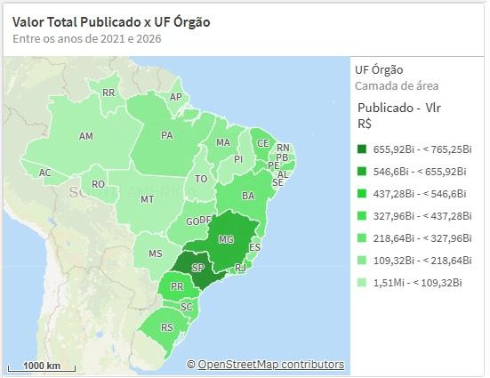

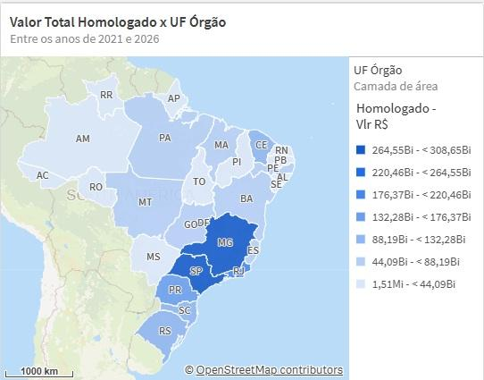

Aqui a visualização é de uma matriz que compara o valor publicado e homologado por ano de publicação, com um drill de mês de publicação, em seguida de UF do Órgão.

:::{tip}
Utilize o **drill-down** clicando no símbolo de seta para baixo (▼) no cabeçalho da matriz para aprofundar a leitura: **Ano → Mês → UF**. Para retornar ao nível anterior, clique na seta para cima (▲).
:::

Essa visualização oferece um comparativo detalhado dos valores financeiros publicados e homologados por UF do Órgão contratante, permitindo acompanhar a evolução das contratações ao longo do tempo em diferentes níveis de detalhamento. A funcionalidade de drill-down possibilita aprofundar a análise do ano para o mês e, posteriormente, para a unidade federativa, facilitando a identificação de padrões regionais, sazonalidades e concentrações de contratação em determinados períodos ou localidades.

---

#### Relação entre Publicado vs. Homologado

Aqui temos um gráfico de dispersão onde cada ponto representa uma UF. Quanto mais à direita e acima, maior o volume financeiro de contratações publicadas e homologadas. Estados próximos da tendência geral apresentam maior equilíbrio entre valores publicados e efetivamente homologados.

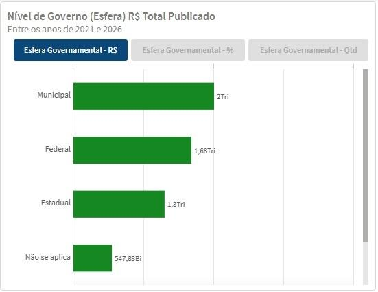

Essa visualização permite comparar o comportamento financeiro das contratações publicadas e homologadas entre as Unidades Federativas, possibilitando identificar estados com maior volume de contratações, padrões de concentração regional e diferenças entre os valores inicialmente publicados e os efetivamente homologados. Quanto mais próximo um estado estiver da tendência geral do gráfico, maior tende a ser a aderência entre os valores publicados e homologados, enquanto desvios mais acentuados podem indicar comportamentos específicos ou diferenças relevantes na execução das contratações públicas.

A partir deste ponto, a visualização e análise é dividida em duas frentes, **Total Publicado** e **Total Homologado**, que podem ser acessadas clicando nos botões correspondentes.

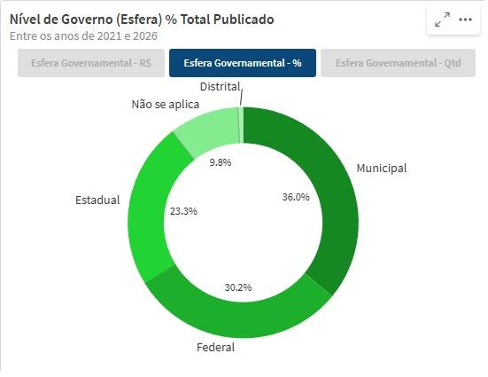

:::{attention}
Ao clicar em **Total Publicado**, todas as visualizações abaixo passam a exibir apenas dados de contratos publicados. Ao clicar em **Total Homologado**, exibem apenas dados homologados. Os dois modos são independentes — certifique-se de estar no modo correto antes de interpretar os gráficos.
:::

---

#### Distribuições (mapa)

Aqui temos um mapa coloroplético do Brasil pelo valor publicado, onde a cor mais escura informa o estado (UF) com maior concentração de contratos Publicados.

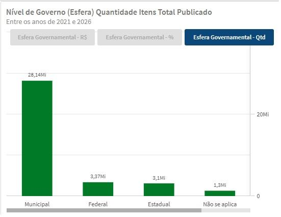

Essa visualização permite identificar a distribuição geográfica das contratações públicas entre os estados brasileiros, evidenciando as regiões com maior concentração financeira de contratos publicados e homologados.

:::{note}
**Leitura do mapa coroplético:** quanto mais escura a tonalidade de um estado, maior é o volume financeiro de contratações associado àquela Unidade Federativa. Estados em cinza claro ou branco indicam baixo volume ou ausência de registros no período selecionado.
:::

---

#### Comparações por dimensão – Esfera

Essa visualização é dividida em três que se alternam através de botões onde:

- **Esfera Governamental - R$**: mostra um gráfico de barras horizontais com os valores por esfera em reais (R$).
- **Esfera Governamental - %**: mostra um gráfico de rosca com os valores % derivada dos valores por esfera em reais (R$).
- **Esfera Governamental - Qtd**: mostra um gráfico de barras verticais com a quantidade de contratos por esfera governamental.

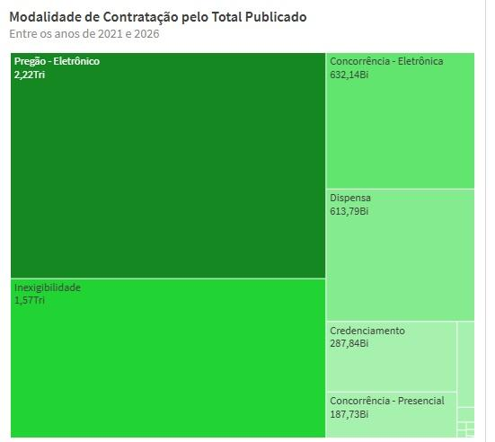

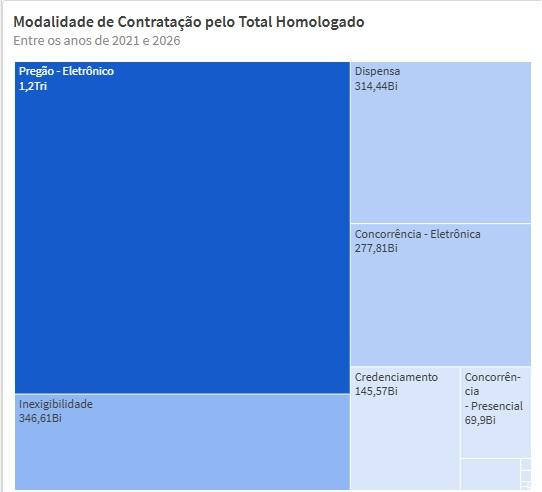

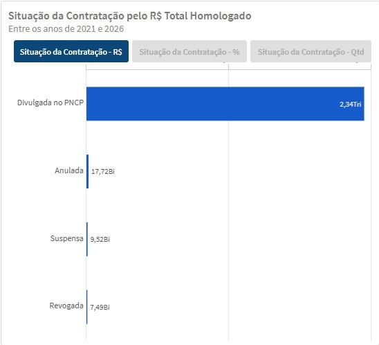

Essa análise permite compreender como as contratações públicas estão distribuídas entre as diferentes esferas governamentais — federal, estadual, municipal e demais classificações existentes na base do PNCP. A alternância entre valor financeiro, participação percentual e quantidade de contratos possibilita observar não apenas qual esfera movimenta mais recursos, mas também qual concentra maior volume de contratações. Essa combinação de perspectivas auxilia na identificação do perfil predominante das contratações públicas no país e evidencia diferenças de comportamento entre os níveis de governo.

---

#### Comparações por dimensão – Modalidade

Temos aqui um gráfico tree map que plota os valores em reais (R$) pela Modalidade de Contratação (Pregão Eletrônico, Concorrência - Eletrônica, Inexigibilidade, Dispensa, Credenciamento, Concorrência Presencial etc.).

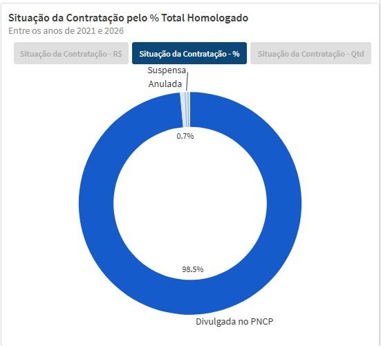

Essa visualização permite identificar quais modalidades de contratação concentram os maiores volumes financeiros dentro do PNCP, facilitando a compreensão sobre os mecanismos mais utilizados pela administração pública para realização das contratações. Quanto maior a área representada no gráfico, maior é o valor financeiro associado à respectiva modalidade. A análise auxilia na percepção da predominância de modalidades como Pregão Eletrônico, Dispensa e Inexigibilidade, além de permitir comparações rápidas entre os diferentes modelos de contratação utilizados pelos órgãos públicos.

---

#### Comparações por dimensão – Situação

E por último temos o total publicado por Situação de Contratação. Essa visualização é dividida em três que se alternam através de botões:

- **Situação de Contratação - R$**: mostra um gráfico de barras horizontais com os valores por situação de contratação em reais (R$).
- **Situação de Contratação - %**: mostra um gráfico de rosca com os valores % derivada dos valores por situação de contratação em reais (R$).
- **Situação de Contratação - Qtd**: mostra um gráfico de barras verticais com a quantidade de contratos por Situação da contratação.

A Situação de Contratação pode ser: **Divulgada no PNCP**, **Suspensa**, **Anulada**, **Revogada**.

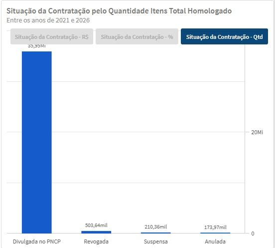

Essa análise permite compreender a distribuição das contratações públicas conforme a situação administrativa em que se encontram dentro do PNCP, evidenciando o volume financeiro, a participação percentual e a quantidade de contratos associados a cada status. A visualização auxilia na identificação da predominância de contratações efetivamente divulgadas no portal, ao mesmo tempo em que mantém transparência sobre processos suspensos, anulados ou revogados, possibilitando uma leitura mais clara do ciclo e da situação operacional das contratações públicas registradas na plataforma.

---

### 4. Filtros

Com a aplicação dos filtros da página Visão Geral, o usuário consegue transformar a leitura nacional do PNCP em análises progressivamente mais específicas, partindo de um panorama amplo das contratações públicas até recortes detalhados por objeto comprado, fornecedor, modalidade, território e situação administrativa.

Os filtros estão organizados em **3 grupos**:

#### 4.1 Contratação (nível macro) – São Filtros que definem o universo principal

- ID Contratação
- Ano / Mês de Publicação (principal filtro)
- Órgão / Unidade / Município / UF
- Modalidade / Instrumento / Modo de disputa
- Situação da contratação
- Indicadores de qualidade (outlier / excluído)

:::{tip}
O **Ano / Mês de Publicação** é o principal filtro da página. Sempre defina o período antes de aplicar os demais filtros — isso garante que todos os indicadores reflitam o recorte temporal correto.
:::

Os filtros de Contratação permitem definir o universo principal da análise. A partir deles, é possível observar o comportamento das contratações por período, órgão, unidade administrativa, município, UF, modalidade, instrumento convocatório, modo de disputa e situação da contratação. Esses filtros ajudam a responder perguntas como: em quais anos houve maior volume de publicações, quais órgãos concentram mais valores, quais estados apresentam maior participação, quais modalidades são mais utilizadas e qual é a situação predominante das contratações registradas no PNCP. Também permitem aplicar critérios de qualidade, como exclusão de outliers ou registros excluídos, garantindo uma leitura mais consistente dos indicadores.

#### 4.2 Item (nível intermediário) - Refina o tipo de compra

- Material ou serviço
- Tipo de benefício
- Critério de julgamento
- Categoria do item

Os filtros de Item aprofundam a análise sobre o conteúdo das contratações, permitindo compreender melhor o que está sendo contratado. Com eles, o usuário pode refinar a leitura por material ou serviço, tipo de benefício, critério de julgamento e categoria do item. Esse nível de análise permite identificar padrões de aquisição, grupos de itens mais representativos, categorias com maior concentração de valores e diferenças entre tipos de contratação. Também possibilita investigar se determinados benefícios ou critérios aparecem com maior frequência em certos tipos de item ou modalidades.

#### 4.3 Resultado (nível final) – Com foco no fornecedor

- Fornecedor (CNPJ/CPF / Nome)
- Porte e natureza jurídica
- País
- Benefícios aplicados
- Status de adjudicação

Já os filtros de Resultado deslocam a análise para o estágio final da contratação, com foco nos fornecedores e nos resultados homologados. Eles permitem observar quem fornece para a administração pública, qual o porte dos fornecedores, sua natureza jurídica, país de origem, aplicação de benefícios, critérios de desempate, margem de preferência, subcontratação e status de adjudicação. Com isso, é possível investigar a composição do mercado fornecedor, a participação de ME/EPP, fornecedores nacionais e internacionais, concentração por porte empresarial e padrões de adjudicação.

Em conjunto, esses três grupos de filtros permitem construir uma leitura multidimensional do PNCP. O usuário pode começar com uma pergunta ampla, como "quanto foi publicado no país em determinado período?", e avançar para questões mais específicas, como "quais órgãos de uma UF publicaram mais contratações por pregão eletrônico?", "quais categorias de item concentram maior valor?", "qual o perfil dos fornecedores homologados?" ou "qual a participação de empresas de determinado porte nas contratações?".

Dessa forma, os filtros não funcionam apenas como mecanismos de seleção, mas como instrumentos de investigação. Eles permitem cruzar tempo, território, órgão, modalidade, item e fornecedor, oferecendo uma visão mais completa sobre o ciclo das contratações públicas: desde a publicação da intenção de contratar até o resultado homologado e a identificação dos fornecedores envolvidos.

---

### 5. Conclusão sobre a Página de Visão Geral

A Página de Visão Geral do painel PNCP em Números permite construir um entendimento consolidado sobre o comportamento nacional das contratações públicas a partir da relação entre intenção de contratação, homologação, distribuição territorial, perfil institucional e características dos procedimentos utilizados. Mais do que apresentar números absolutos, a página organiza os dados de forma a revelar padrões estruturais do processo de contratação pública registrado no PNCP.

O primeiro entendimento proporcionado pela página é a distinção entre o que foi **publicado** e o que foi **homologado**. Essa separação é central para a leitura correta do painel, pois permite diferenciar a intenção inicial de contratar, representada pelos valores e quantidades publicados, do resultado efetivamente homologado, que se aproxima mais da contratação concretizada. Com isso, o usuário consegue avaliar não apenas o volume de registros existentes, mas também a distância entre planejamento, publicação e resultado.

A evolução temporal permite observar o comportamento das contratações ao longo dos anos, evidenciando tendências de crescimento, retração, estabilidade ou mudança no ritmo de registros publicados e homologados. Essa leitura histórica ajuda a compreender se o volume de contratações acompanha uma trajetória consistente, se há períodos de maior concentração ou se ocorrem oscilações relevantes que merecem investigação complementar.

A análise por ano, mês e UF permite aprofundar a leitura temporal e territorial, mostrando como o comportamento nacional se distribui em diferentes recortes. Esse detalhamento possibilita identificar padrões regionais, sazonalidades, concentração em determinados períodos e diferenças entre Unidades Federativas, oferecendo uma base para análises comparativas entre estados e momentos distintos.

A comparação entre valores publicados e homologados por UF permite avaliar a relação entre intenção de contratação e efetiva homologação em cada território. Essa leitura contribui para identificar estados com maior volume de movimentação, diferenças de comportamento entre publicação e homologação e eventuais distorções ou concentrações que indiquem necessidade de análise mais detalhada.

Os mapas coropléticos reforçam a compreensão territorial, permitindo visualizar de forma imediata onde se concentram os maiores volumes financeiros de contratações. Essa perspectiva espacial facilita a identificação de padrões de concentração regional e oferece uma leitura mais intuitiva da distribuição nacional dos registros do PNCP.

As comparações por esfera governamental permitem compreender como as contratações se distribuem entre os níveis federal, estadual, municipal e demais classificações. Ao alternar entre valor financeiro, percentual e quantidade, o usuário consegue observar se determinada esfera concentra mais recursos, maior volume operacional ou maior participação relativa no universo analisado. Essa leitura ajuda a diferenciar concentração financeira de intensidade administrativa.

A análise por modalidade de contratação permite identificar quais instrumentos procedimentais têm maior relevância no conjunto das contratações públicas. Essa leitura mostra o peso relativo de modalidades como pregão, dispensa, inexigibilidade, concorrência e demais formas de contratação, ajudando a compreender como a administração pública estrutura seus processos de aquisição.

A análise por situação da contratação permite acompanhar o estado administrativo dos registros no PNCP, diferenciando contratações divulgadas, suspensas, anuladas ou revogadas. Essa visão contribui para a transparência, pois permite observar não apenas o universo principal das contratações válidas, mas também os registros que fazem parte do histórico auditável do processo público.

Em síntese, a Página de Visão Geral oferece uma leitura integrada sobre **quanto se publica**, **quanto se homologa**, **onde se concentra**, **quem contrata**, **como se contrata** e **em que situação** os registros se encontram. Seu principal valor está em transformar um grande volume de dados administrativos em uma narrativa analítica sobre o funcionamento das contratações públicas no país, permitindo que o usuário identifique padrões, acompanhe tendências e direcione investigações mais detalhadas nas demais páginas do painel.

---

## PNCP em Números – Página Contratações Publicadas

### 6. Objetivo da página

A página Contratações Publicadas tem como objetivo aprofundar a análise sobre as contratações registradas no PNCP no momento da publicação. Diferente da página de Visão Geral, que apresenta um panorama consolidado entre publicado e homologado, esta página é focada exclusivamente na etapa de publicação, ou seja, na intenção formal de contratação registrada no Portal Nacional de Contratações Públicas.

Essa página permite compreender onde as contratações foram publicadas, quais órgãos publicaram, quais modalidades e instrumentos foram utilizados, quais tipos de benefícios estão associados aos itens, quais critérios de julgamento foram aplicados e quais características estruturam o processo de contratação no momento inicial.

---

### 7. Indicadores principais

#### Cards e KPI's

Nos KPI's de contratações publicadas temos:

- Valor Publicado (Publicado - Vlr R$);
- Quantidade de itens Publicados (Publicado - Qtd Itens);
- Quantidade de Contratações Publicadas (Publicado - Qtd Contratações);
- Quantidade de Portais os quais foram feitas as publicações (Publicado - Qtd Portais).

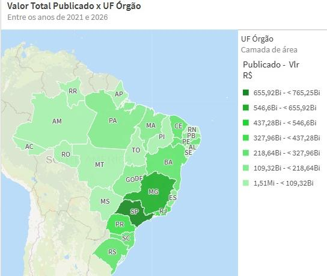

Esses indicadores gerais têm como objetivo fornecer uma visão rápida e consolidada do comportamento das contratações públicas registradas no PNCP, permitindo identificar o volume financeiro movimentado, a quantidade de contratações realizadas, o quantitativo de itens envolvidos e a abrangência dos portais utilizados, servindo como ponto de partida para análises mais detalhadas ao longo do painel.

---

#### Distribuições (mapa)

Aqui temos um mapa coloroplético do Brasil com o valor publicado por UF do órgão contratante. A cor mais escura indica as Unidades Federativas com maior concentração financeira de contratações publicadas. Quanto mais intensa a tonalidade apresentada no mapa, maior é o volume financeiro associado à respectiva Unidade Federativa.

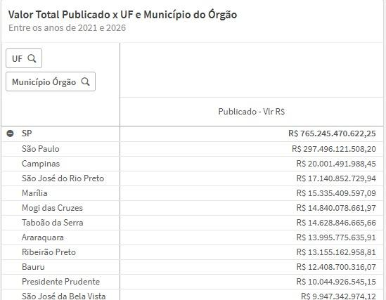

Essa visualização permite identificar a distribuição geográfica das contratações públicas publicadas no PNCP, evidenciando os estados com maior concentração de valores estimados. A leitura territorial facilita a percepção de padrões regionais e permite comparar o comportamento das publicações entre diferentes UFs.

---

#### Matriz por UF e Município

Em seguida, a página apresenta uma matriz com o valor publicado, permitindo o detalhamento por UF do Órgão → Município do Órgão.

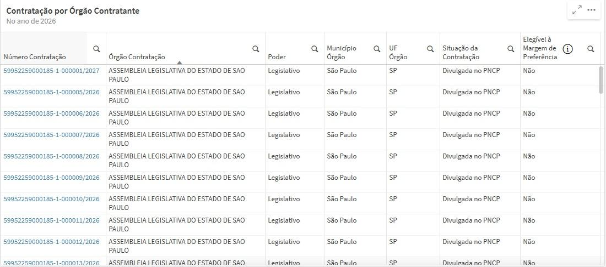

Essa visualização possibilita aprofundar a análise territorial, saindo da visão por estado para uma leitura municipal. Com isso, o usuário consegue identificar não apenas quais UFs concentram mais valores publicados, mas também quais municípios possuem maior participação dentro de cada estado.

A matriz é especialmente útil para análises locais, pois permite localizar concentrações de valores em municípios específicos e compreender como a distribuição das contratações publicadas se comporta dentro de cada Unidade Federativa.

---

#### Tabela de Contratações por Órgão Contratante

A visualização apresenta uma tabela de detalhamento das contratações por órgão contratante. Essa tabela exibe informações operacionais importantes, como:

- Número da contratação;
- Link para o edital no PNCP;
- Órgão contratante;
- Poder;
- Município do órgão;
- UF do órgão;
- Situação da contratação;
- Elegível à margem de preferência.

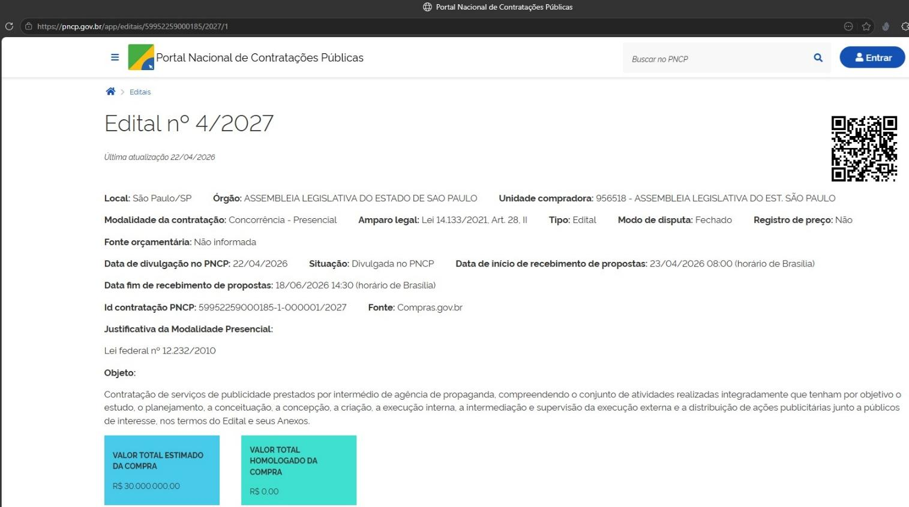

Essa tabela permite que o usuário saia da visão agregada e acesse informações mais específicas sobre cada contratação publicada. O campo com o número da contratação contém link direto para o edital no PNCP, permitindo rastreabilidade e consulta à fonte oficial.

:::{tip}
Clique no número da contratação na tabela para acessar diretamente o edital publicado no **portal PNCP** (pncp.gov.br). Esse link garante rastreabilidade e permite consulta à fonte oficial sem necessidade de busca manual.
:::

No campo **Elegível à Margem de Preferência**, há um ícone de informação que abre uma visualização complementar. Essa visualização apresenta KPIs relacionados ao valor da margem de preferência, percentual do valor com margem de preferência e um gráfico de rosca com a distribuição percentual por amparo legal.

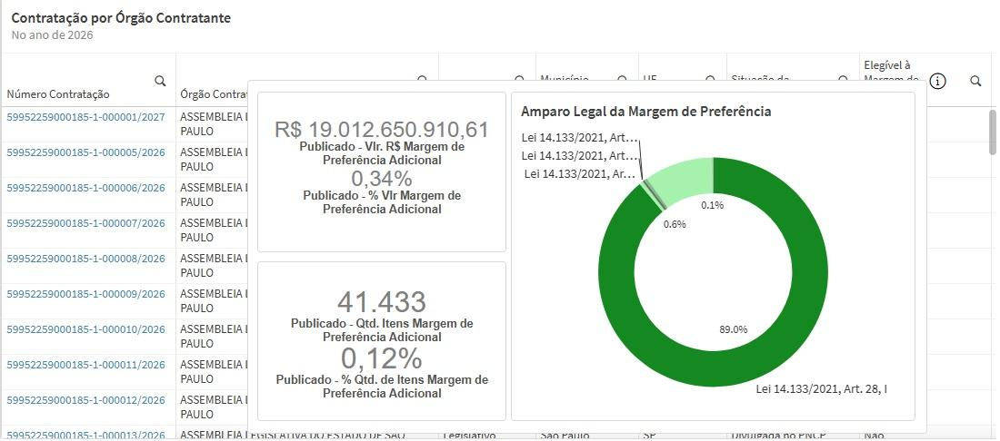

Essa funcionalidade ajuda a explicar, de forma mais detalhada, o impacto da margem de preferência nas contratações publicadas, sem sobrecarregar a tela principal com informações adicionais.

---

#### Tendência temporal das contratações publicadas

A visualização apresenta um gráfico de linha de Valor Total de Contratações x Data de Publicação, mostrando a evolução dos valores publicados ao longo dos anos. A visualização em reais (R$) pode ser alternada para quantidade de contratações publicadas.

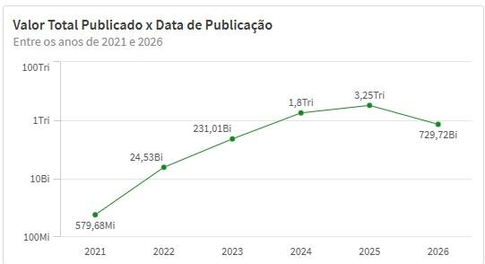

Essa análise permite acompanhar a evolução temporal das publicações no PNCP, identificando crescimento, queda, estabilidade ou variações relevantes no volume financeiro e na quantidade de contratações. O gráfico ajuda a compreender como o comportamento das publicações se altera ao longo do tempo e permite identificar períodos de maior concentração de registros.

---

#### Tipo de Benefício

A visualização de Tipo de Benefício apresenta a distribuição das contratações publicadas conforme os benefícios associados aos itens. O gráfico possui duas formas de leitura:

- Gráfico de barras horizontais com valores em reais (R$);
- Gráfico de rosca com participação percentual.

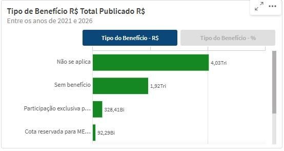

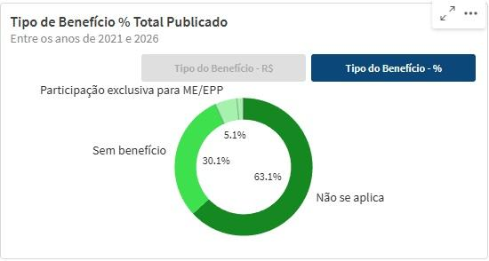

Essa análise permite compreender quais tipos de benefício aparecem com maior relevância nas contratações publicadas, seja em valor financeiro absoluto ou em participação percentual. Com isso, o usuário pode identificar a presença de benefícios como participação exclusiva, cota reservada, subcontratação ou ausência de benefício, conforme a classificação existente na base.

---

#### Portal de Contratação

O gráfico de Portal de Contratação apresenta o valor publicado por portal ou sistema de origem.

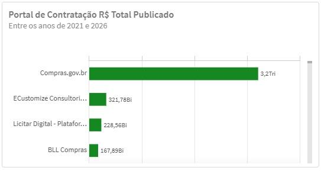

Essa visualização permite identificar quais portais concentram maior volume financeiro de publicações no PNCP. A análise é importante para compreender a origem dos registros e a participação relativa dos diferentes sistemas utilizados pelos órgãos públicos para publicação de contratações.

---

#### Instrumento Convocatório

A visualização de Instrumento Convocatório é dividida em duas formas de análise:

- Gráfico de barras horizontais com valores em reais (R$);
- Gráfico de rosca com participação percentual.

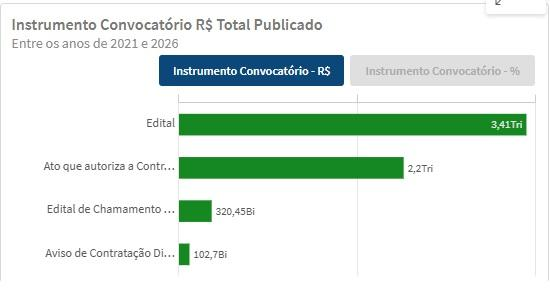

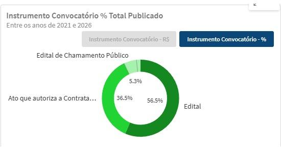

Essa análise permite observar quais instrumentos são mais utilizados nas contratações publicadas e qual o peso financeiro de cada um no total analisado. Ela ajuda a compreender se as publicações se concentram em editais, atos autorizativos, chamamentos, avisos ou outros instrumentos registrados na base.

---

#### Critério de Julgamento

A visualização de Critério de Julgamento também é dividida em duas formas de leitura:

- Gráfico de barras horizontais com valores em reais (R$);
- Gráfico de rosca com participação percentual.

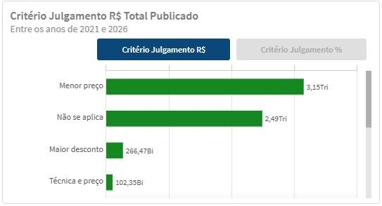

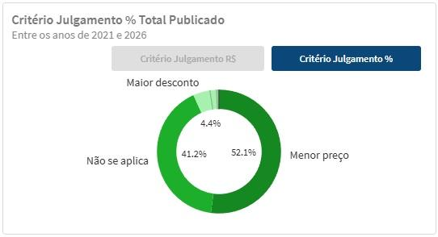

Essa análise permite identificar quais critérios de julgamento concentram os maiores valores nas contratações publicadas, como menor preço, maior desconto, técnica e preço, entre outros. O objetivo é mostrar como os processos de contratação são estruturados quanto ao método de escolha da proposta vencedora.

---

#### Modalidade de Contratação

A página apresenta um gráfico do tipo treemap com os valores publicados por modalidade de contratação, como:

- Pregão Eletrônico
- Concorrência Eletrônica
- Inexigibilidade
- Dispensa
- Credenciamento
- Concorrência Presencial
- Entre outras

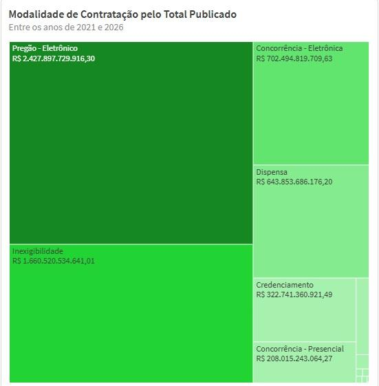

Essa visualização permite identificar quais modalidades concentram os maiores valores financeiros nas publicações do PNCP. Quanto maior o bloco no treemap, maior é o volume financeiro associado à respectiva modalidade. A análise facilita a percepção da predominância de determinados modelos de contratação e permite comparar rapidamente o peso relativo de cada modalidade.

---

#### Modo de Disputa

Por fim, a página apresenta as visualizações de Modo de Disputa, divididas em duas formas:

- Gráfico de barras horizontais com valor em reais (R$);
- Gráfico de rosca com participação percentual.

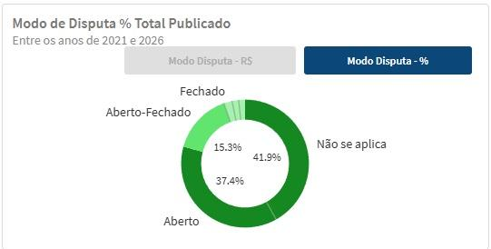

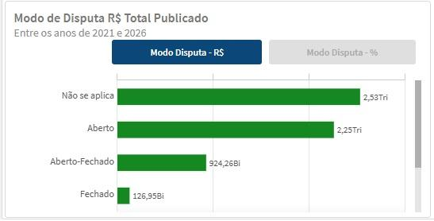

Essa análise permite compreender como as contratações publicadas se distribuem conforme o modo de disputa adotado, como aberto, fechado, combinado ou não aplicável. A visualização auxilia na compreensão da dinâmica competitiva dos processos de contratação e mostra quais formas de disputa têm maior representatividade financeira no universo analisado.

---

### 8. Filtros

Os filtros da página estão organizados em dois grupos principais: **Contratação** e **Item**.

#### 8.1 Filtros de Contratação

Os filtros de contratação definem o universo principal da análise. Eles permitem recortar os dados por identificação da contratação, período de publicação, órgão responsável, localização, modalidade, instrumento, situação e indicadores de qualidade.

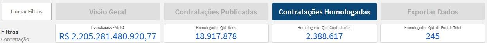

**Filtros disponíveis:**

- ID Contratação
- Ano Publicação
- Mês Publicação
- Órgão Contratação
- CNPJ Órgão Contratação
- Unidade Órgão Contratação
- Município Órgão Contratação
- UF Órgão Contratação
- Instrumento Convocatório
- Situação da Contratação
- Portal de Contratação
- Modalidade de Contratação
- Nível de Governo / Esfera Governamental
- Modo de Disputa
- Amparo Legal
- SRP — Sistema de Registro de Preços
- Indicador Compra Outlier
- Indicador Contratação Excluída

Esses filtros permitem analisar o comportamento das contratações publicadas a partir de diferentes perspectivas institucionais, territoriais e procedimentais. Com eles, é possível responder perguntas como: quais órgãos mais publicaram contratações, em quais estados houve maior concentração de valores, quais modalidades foram mais utilizadas, quais instrumentos convocatórios predominaram e quais contratações foram classificadas como outliers ou excluídas.

#### 8.2 Filtros de Item

Os filtros de item permitem refinar a análise de acordo com as características dos bens ou serviços previstos nas contratações publicadas.

**Filtros disponíveis:**

- Situação do Item
- Material ou Serviço
- Tipo de Benefício
- Margem Preferência Adicional
- Incentivo Produtivo Básico
- Critério de Julgamento
- Patrimônio
- Orçamento Sigiloso
- Código NCM/NBS
- Nome NCM/NBS
- Código Item Catálogo
- Categoria Item

Esses filtros aprofundam a leitura sobre o conteúdo das contratações, permitindo observar o tipo de item publicado, sua classificação, critérios aplicados, existência de benefícios e características específicas relacionadas ao julgamento e à composição do objeto contratado.

---

### 9. Conclusão sobre a Página Contratações Publicadas

A Página Contratações Publicadas permite compreender o comportamento das contratações públicas no momento da publicação, ou seja, na fase em que a administração pública formaliza sua intenção de contratar bens ou serviços. A partir dela, é possível analisar onde as contratações são publicadas, quais órgãos concentram maior volume, quais modalidades e instrumentos são mais utilizados, quais critérios de julgamento predominam e quais tipos de benefícios estão associados aos itens.

A página combina uma leitura territorial, institucional, temporal e procedimental das contratações publicadas. Isso permite ao usuário identificar padrões de concentração, acompanhar a evolução das publicações ao longo dos anos, compreender a origem dos registros por portal, verificar a participação de modalidades e instrumentos específicos e aprofundar a análise até o nível de órgão, município e item.

Em síntese, essa página responde à pergunta: **Como, onde, por quem e sob quais características as contratações públicas são publicadas no PNCP?**

Ela transforma os dados de publicação em uma leitura organizada sobre a intenção de contratação do setor público, permitindo análises estratégicas, transparência e investigação detalhada antes da etapa de homologação.

---

## PNCP em Números – Página Contratações Homologadas

### 10. Objetivo da Página

A página Contratações Homologadas tem como objetivo apresentar a etapa posterior à publicação das contratações públicas: o momento em que os processos avançam para resultado, com valores homologados e identificação dos fornecedores contratados. Enquanto a página de Contratações Publicadas mostra a intenção inicial de contratação, esta página aprofunda a análise sobre aquilo que foi efetivamente homologado, permitindo observar valores, quantidades, fornecedores, natureza jurídica, porte empresarial, origem nacional ou internacional e aplicação de benefícios.

Essa página é especialmente importante para compreender a relação entre o valor contratado, o perfil dos fornecedores e as características dos resultados registrados no PNCP.

---

### 11. Indicadores Nacionais Principais

#### Cards e KPI's

No topo da página são apresentados os KPIs gerais das contratações homologadas:

- Valor Homologado — Homologado - Vlr R$
- Quantidade de Itens Homologados — Homologado - Qtd Itens
- Quantidade de Contratações Homologadas — Homologado - Qtd Contratações
- Quantidade de Portais com Homologações — Homologado - Qtd Portais

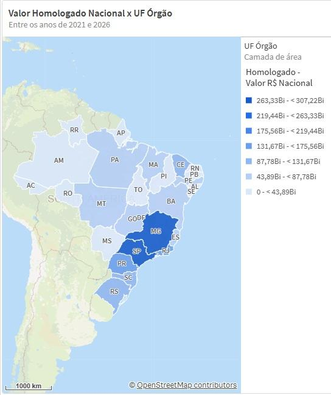

Esses indicadores apresentam uma visão consolidada do volume de contratações homologadas, permitindo compreender rapidamente o valor financeiro contratado, a quantidade de itens envolvidos, o número de contratações homologadas e a quantidade de portais responsáveis pelos registros. Eles funcionam como ponto de partida para a análise da página, orientando a leitura dos demais gráficos e tabelas.

---

#### Indicadores específicos — ME/EPP

Em seguida, a página apresenta KPIs específicos relacionados às contratações homologadas com participação de ME/EPP.

:::{note}
**ME/EPP** significa **Microempresa / Empresa de Pequeno Porte**. Não confundir com MEI (Microempreendedor Individual), que é uma categoria distinta. O painel segrega esses indicadores para facilitar o acompanhamento das políticas de tratamento diferenciado previstas na Lei Complementar nº 123/2006.
:::

Indicadores apresentados:

- Valor Homologado ME/EPP — Homologado - Total ME/EPP;
- Quantidade de Itens Homologados ME/EPP — Homologado - Qtd Itens ME/EPP;
- Quantidade de Contratações Homologadas ME/EPP — Homologado - Qtd Contratações ME/EPP;
- Quantidade de Portais com Homologações ME/EPP — Homologado - Qtd Portais ME/EPP.

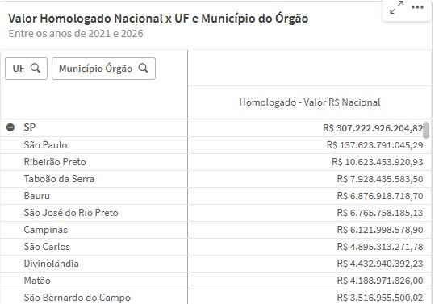

Esses indicadores permitem avaliar a participação das microempresas e empresas de pequeno porte nas contratações homologadas, tanto em valor financeiro quanto em quantidade de itens, contratações e portais. Essa leitura é importante para acompanhar a presença de fornecedores de menor porte no mercado público e verificar a representatividade desse segmento nos resultados homologados.

---

#### Alternância entre Fornecedores Nacionais e Internacionais

A página possui uma divisão por botões que permite alternar entre:

- Contratações de Fornecedores Nacionais
- Contratações de Fornecedores Internacionais

Quando o usuário seleciona **Fornecedores Nacionais**, os gráficos e indicadores passam a exibir apenas os valores e quantidades vinculados a fornecedores nacionais. Quando seleciona **Fornecedores Internacionais**, a página apresenta os resultados relacionados a fornecedores estrangeiros.

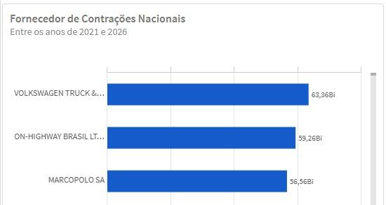

:::{attention}
A seleção entre **Nacional** e **Internacional** altera **todos** os indicadores e gráficos da página simultaneamente, incluindo KPIs, mapas, tabelas e tendência temporal. Verifique sempre qual modo está ativo antes de interpretar os dados.
:::

Essa alternância permite comparar a participação nacional e internacional nas contratações homologadas, possibilitando avaliar a origem dos fornecedores, a concentração territorial dos contratos, o volume financeiro associado e possíveis diferenças entre o perfil das contratações realizadas com fornecedores brasileiros e estrangeiros.

---

#### Distribuição territorial — Mapa coroplético

No modo de fornecedores nacionais, a página apresenta um mapa coroplético do Brasil com o valor homologado por UF do órgão contratante. A cor mais escura representa as Unidades Federativas com maior concentração financeira de contratações homologadas.

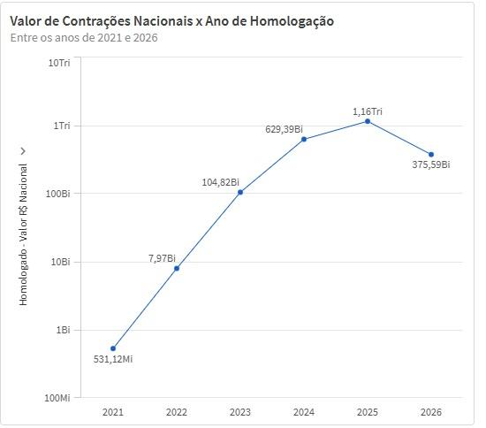

Essa visualização permite compreender a distribuição geográfica dos valores homologados no território nacional, evidenciando onde se concentram os maiores volumes financeiros contratados. A análise espacial facilita a identificação de padrões regionais, diferenças entre estados e concentração de contratações homologadas em determinadas Unidades Federativas.

---

#### Matriz por UF e Município

A página apresenta uma matriz com o valor homologado, permitindo o detalhamento por UF Órgão e Município Órgão.

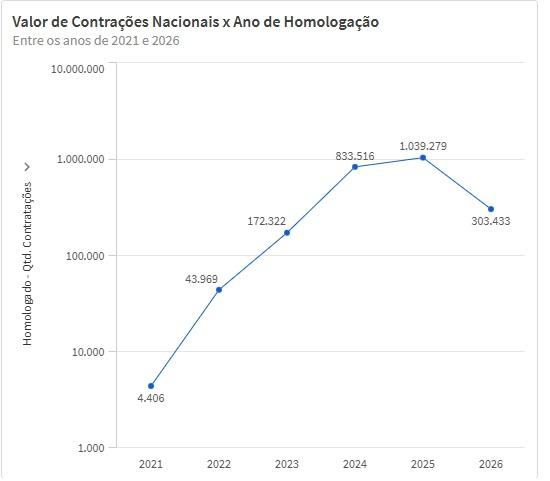

Essa visualização possibilita aprofundar a análise territorial, partindo da visão estadual para a leitura municipal. Com isso, o usuário consegue identificar quais municípios concentram os maiores valores homologados dentro de cada UF, permitindo uma investigação mais precisa sobre a distribuição local das contratações.

---

#### Maiores fornecedores contratados

Logo abaixo, a página apresenta um gráfico de barras horizontais com os maiores fornecedores nacionais por valor homologado em reais.

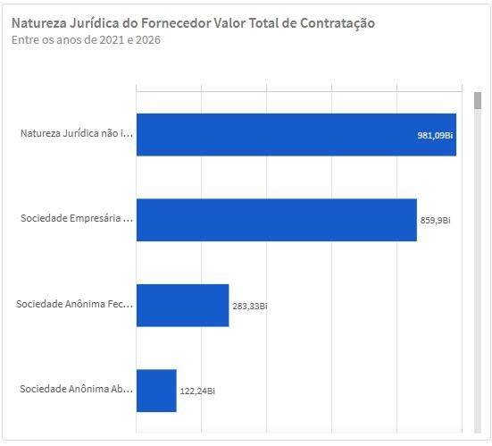

Essa visualização permite identificar os fornecedores que concentram os maiores valores contratados no período e no recorte selecionado. A análise é útil para observar concentração de mercado, fornecedores recorrentes e participação relativa dos principais contratados dentro do universo analisado.

---

#### Tendência temporal das contratações homologadas

Temos agora um gráfico de linha de Valor Total de Contratações x Data de Publicação, mostrando a evolução dos valores homologados ao longo dos anos. A visualização em reais (R$) pode ser alternada para quantidade de contratações homologadas.

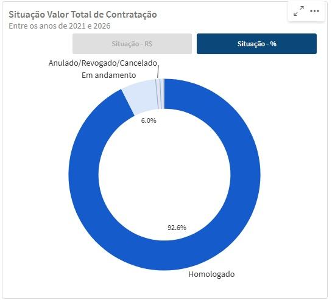

Essa análise permite acompanhar a evolução histórica das contratações homologadas, identificando crescimento, redução, estabilidade ou oscilações relevantes no volume financeiro e na quantidade de resultados. O gráfico ajuda a compreender como o comportamento das homologações se altera ao longo do tempo e permite avaliar a dinâmica dos resultados em diferentes períodos.

---

#### Natureza jurídica dos fornecedores

A página conta com um gráfico de barras horizontais com o valor homologado por natureza jurídica dos fornecedores.

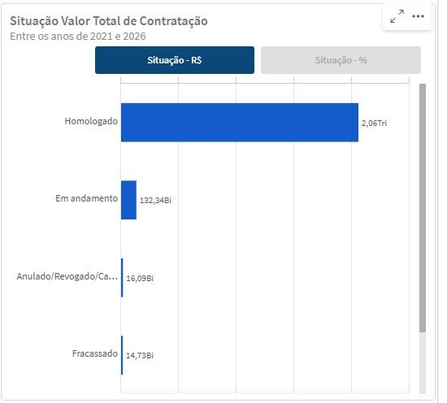

Essa visualização permite compreender quais tipos de natureza jurídica concentram maior volume financeiro nas contratações homologadas, como sociedades empresárias, empresários individuais, entidades públicas, associações ou outras classificações disponíveis na base. Essa leitura contribui para entender o perfil jurídico dos fornecedores que participam das contratações públicas.

---

#### Situação da contratação

A visualização de Situação da Contratação é dividida em duas formas de análise:

- Gráfico de barras horizontais com valores em reais (R$)
- Gráfico de rosca com participação percentual

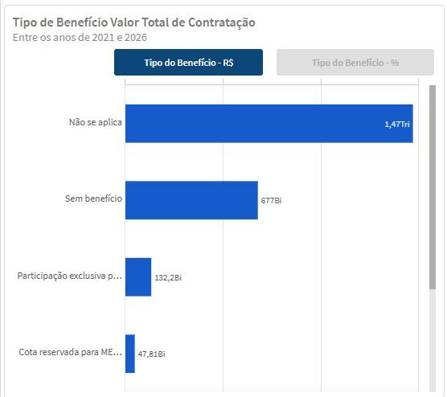

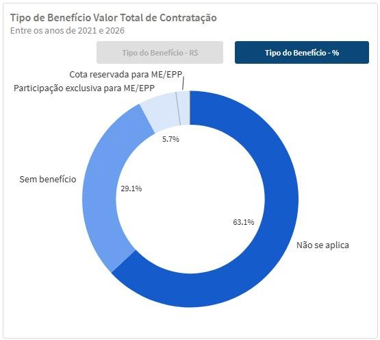

As situações podem incluir:

- Divulgada no PNCP
- Homologado
- Em andamento
- Anulado / Revogado / Cancelado
- Fracassado

Essa análise permite compreender o estado administrativo das contratações homologadas dentro do PNCP, mostrando a distribuição financeira e percentual dos registros conforme sua situação. A visualização auxilia na identificação da predominância de determinadas situações e mantém transparência sobre processos que, mesmo não representando o fluxo final esperado, compõem o histórico auditável das contratações públicas.

---

#### Tipo de benefício

A página apresenta o gráfico de Tipo de Benefício associado ao valor da contratação. Essa visualização é dividida em duas formas:

- Gráfico de barras horizontais com valores em reais (R$);
- Gráfico de rosca com participação percentual.

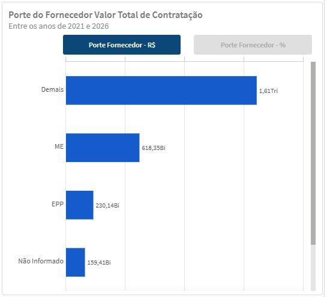

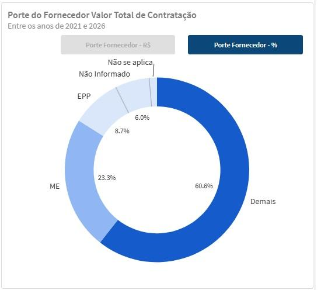

Essa análise permite observar a distribuição dos valores homologados conforme os benefícios aplicados, como benefício ME/EPP, cota reservada, subcontratação ou ausência de benefício, conforme a classificação disponível na base. A leitura contribui para avaliar a presença e a relevância de políticas públicas de incentivo ou tratamento diferenciado nas contratações homologadas.

---

#### Porte do fornecedor

A visualização de Porte do Fornecedor também é dividida em duas formas:

- Gráfico de barras horizontais com valores em reais (R$);
- Gráfico de rosca com participação percentual.

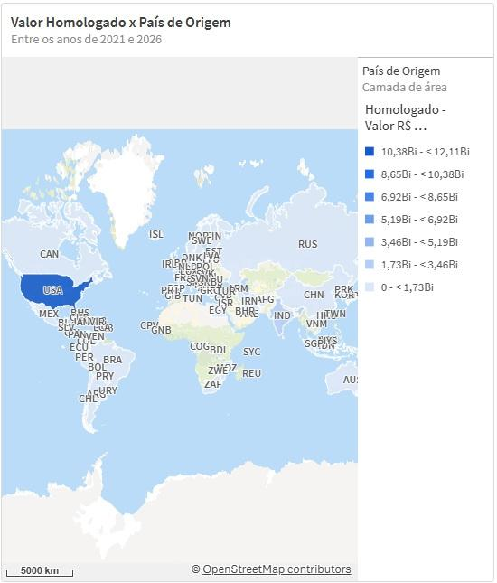

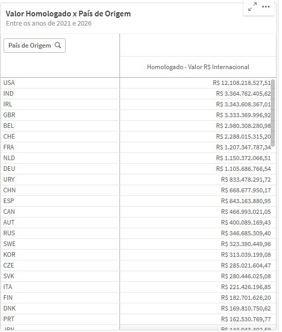

Essa análise permite compreender como o valor homologado se distribui entre fornecedores de diferentes portes, como ME, EPP, MEI, demais empresas ou outras classificações existentes na base. A alternância entre valor absoluto e percentual facilita a comparação entre a participação financeira de cada grupo e sua representatividade dentro do total homologado.

---

#### Tabela de contratação por fornecedor contratado

Por último, a página apresenta uma tabela com detalhamento das contratações por fornecedor contratado. A tabela exibe informações como:

- Número da contratação
- Link para o edital no PNCP
- Nome do fornecedor
- Órgão contratante
- Poder
- Município do órgão
- UF do órgão
- Situação da contratação
- Aplicação da margem de preferência

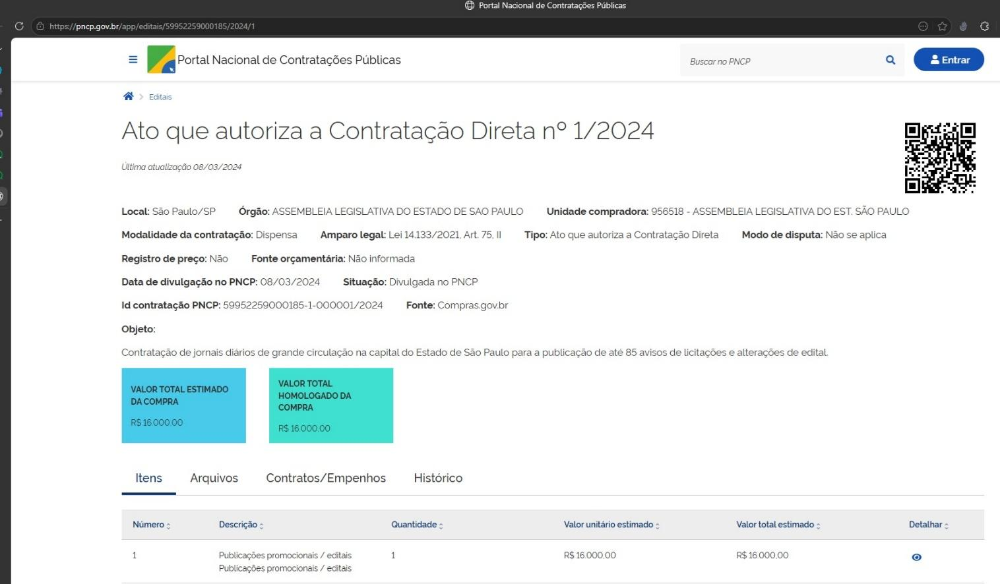

Essa tabela permite sair da visão agregada e consultar informações mais específicas sobre cada contratação homologada e seu respectivo fornecedor. O link para o edital no PNCP garante rastreabilidade e permite consulta direta à fonte oficial.

No campo **Aplicação da Margem de Preferência**, há um ícone de informação que abre uma visualização complementar com:

- KPI de valor em reais da margem de preferência
- KPI de percentual do valor com margem de preferência
- Gráfico de rosca com os percentuais de amparo legal da margem de preferência

Essa funcionalidade permite detalhar o uso da margem de preferência sem sobrecarregar a tabela principal, oferecendo uma camada adicional de análise para usuários que desejam aprofundar o entendimento sobre esse instrumento.

---

### 12. Indicadores Internacionais Principais

Ao selecionar o botão **Contratações de Fornecedores Internacionais**, a página passa a exibir exclusivamente os valores e quantidades relacionados às contratações homologadas com fornecedores estrangeiros. Essa visualização permite analisar a participação internacional nas contratações públicas registradas no PNCP, destacando os países de origem, os principais fornecedores internacionais e a evolução temporal dos valores homologados.

---

#### Distribuição territorial — Mapa coroplético (Internacional)

No modo internacional, é apresentado um mapa coroplético mundial pelo valor homologado.

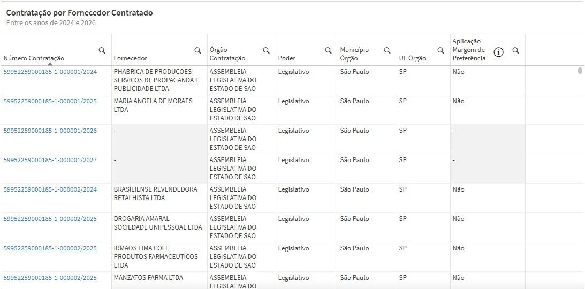

Nesse mapa, a cor mais escura indica os países com maior concentração financeira de contratos homologados. Essa visualização permite identificar, de forma territorial, quais países possuem maior participação nas contratações públicas brasileiras, oferecendo uma leitura rápida sobre a origem geográfica dos fornecedores internacionais.

---

#### Tabela País Valores Homologados

Em seguida, a página apresenta uma tabela com o valor homologado por país, permitindo uma leitura mais objetiva e comparativa da participação de cada país no total contratado.

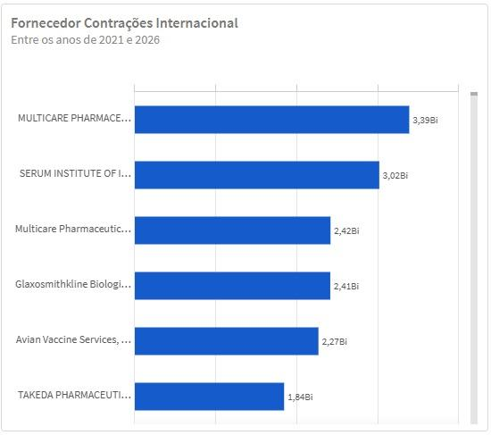

Essa tabela complementa o mapa ao apresentar os valores de forma ordenada e detalhada, facilitando a identificação dos principais países fornecedores.

---

#### Maiores fornecedores contratados (Internacional)

Logo abaixo, há um gráfico de barras horizontais com os maiores fornecedores internacionais por valor homologado em reais (R$).

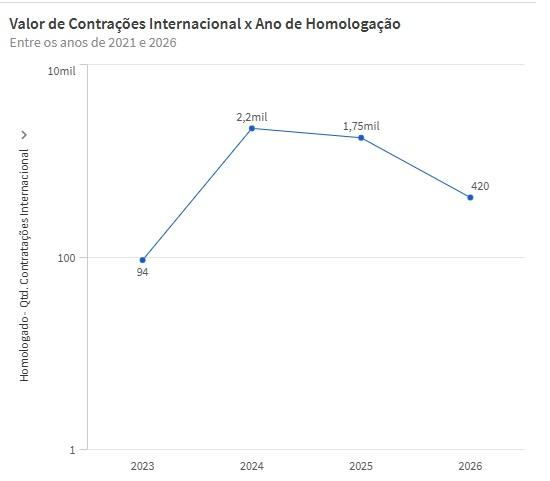

Essa visualização permite identificar quais fornecedores estrangeiros concentram os maiores valores contratados, contribuindo para a análise de concentração, recorrência e relevância dos principais fornecedores internacionais no conjunto das contratações homologadas.

---

#### Tendência temporal das contratações homologadas (Internacional)

Por fim, a página apresenta um gráfico de linha de Valor Total de Contratações x Data de Publicação, permitindo acompanhar a evolução dos valores homologados internacionais ao longo dos anos.

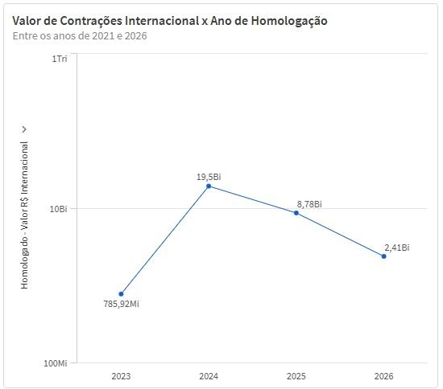

A visualização pode ser alternada entre valores em reais (R$) e quantidade de contratações homologadas, possibilitando analisar tanto o crescimento financeiro quanto o volume de registros associados a fornecedores internacionais.

Essa seção permite compreender a dimensão internacional das contratações públicas, evidenciando quais países e fornecedores estrangeiros possuem maior participação nos resultados homologados. A análise contribui para identificar padrões de contratação internacional, concentração por país, principais fornecedores e evolução histórica desse tipo de contratação dentro do PNCP.

---

### 13. Filtros

Os filtros da página estão organizados em três grupos: **Contratação**, **Item** e **Resultado**.

#### 13.1 Filtros de Contratação

Os filtros de contratação definem o universo principal da análise, permitindo recortar os dados por período, órgão contratante, localização, modalidade, instrumento, situação da contratação e indicadores de qualidade.

**Filtros disponíveis:**

- ID Contratação
- Ano Publicação
- Mês Publicação
- Órgão Contratação
- CNPJ Órgão Contratação
- Unidade Órgão Contratação
- Município Órgão Contratação
- UF Órgão Contratação
- Instrumento Convocatório
- Situação da Contratação
- Portal de Contratação
- Modalidade de Contratação
- Nível de Governo / Esfera Governamental
- Modo de Disputa
- Amparo Legal
- SRP — Sistema de Registro de Preços
- Indicador Compra Outlier
- Indicador Contratação Excluída

Esses filtros permitem delimitar o conjunto de contratações homologadas a partir de critérios institucionais, territoriais, temporais e procedimentais. Com eles, o usuário pode investigar, por exemplo, quais órgãos homologaram maiores valores, quais estados concentram mais contratações homologadas, quais modalidades tiveram maior volume contratado e como os valores se distribuem entre diferentes períodos.

#### 13.2 Filtros de Item

Os filtros de item permitem refinar a análise a partir das características dos bens ou serviços vinculados às contratações homologadas.

**Filtros disponíveis:**

- Situação do Item
- Material ou Serviço
- Tipo de Benefício
- Margem Preferência Adicional
- Incentivo Produtivo Básico
- Critério de Julgamento
- Patrimônio
- Orçamento Sigiloso
- Código NCM/NBS
- Nome NCM/NBS
- Código Item Catálogo
- Categoria Item

Esses filtros ajudam a compreender o que foi contratado, permitindo observar os tipos de item, categorias, critérios de julgamento e benefícios associados aos resultados homologados. Eles possibilitam uma leitura mais detalhada do conteúdo das contratações, indo além do órgão e do fornecedor.

#### 13.3 Filtros de Resultado

Os filtros de resultado concentram-se no fornecedor e nas características da homologação.

**Filtros disponíveis:**

- ID Contratação
- Ano Resultado
- Mês Resultado
- CNPJ/CPF Fornecedor
- Nome Fornecedor
- Natureza Jurídica Fornecedor
- Porte Fornecedor
- Código País Fornecedor
- Tipo Pessoa
- Subcontratação
- Status Adjudicado
- Situação Item Resultado
- Aplicação Margem de Preferência
- Amparo Legal Margem de Preferência
- Aplicação Benefício ME/EPP
- Aplicação Critério Desempate
- Amparo Legal Critério de Desempate
- País de Origem do Produto ou Serviço
- Indicador Homologado Outlier

Esses filtros permitem analisar o resultado das contratações sob a perspectiva do fornecedor. Com eles, o usuário pode investigar a participação de fornecedores nacionais e internacionais, o porte das empresas contratadas, a natureza jurídica dos fornecedores, a aplicação de benefícios, margem de preferência, critérios de desempate e situações relacionadas à adjudicação.

---

### 14. Conclusão sobre a Página Contratações Homologadas

A Página Contratações Homologadas permite compreender o comportamento das contratações públicas na etapa de resultado, evidenciando os valores efetivamente homologados, a quantidade de contratações e itens envolvidos, os principais fornecedores, o perfil jurídico e o porte das empresas contratadas, além da participação de fornecedores nacionais e internacionais.

A página combina uma leitura territorial, temporal, institucional e mercadológica. Por meio dela, o usuário pode identificar onde se concentram os valores homologados, quais fornecedores possuem maior participação, como os resultados se distribuem entre diferentes naturezas jurídicas e portes empresariais, quais tipos de benefício estão associados às contratações e como a homologação evolui ao longo do tempo.

Em síntese, essa página responde à pergunta:

> **Quem foi contratado, em quais condições, com quais valores e sob quais características institucionais, territoriais e econômicas?**

Ela complementa a leitura da página de Contratações Publicadas ao deslocar o foco da intenção de contratação para o resultado homologado, permitindo uma análise mais próxima da efetivação das contratações públicas registradas no PNCP.

---

## Histórico de Revisões

| Data | Versão | Descrição | Autor |
|---|---|---|---|
| 2026-05-14 | 1.0 | Versão inicial | Bruno Almeida |
